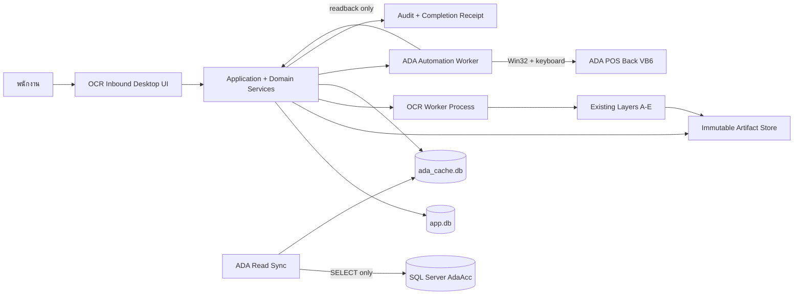
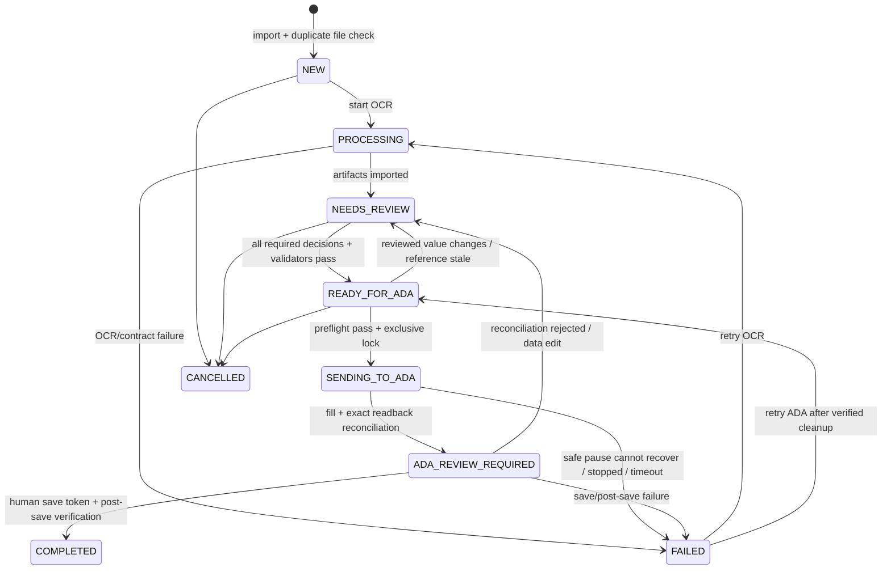
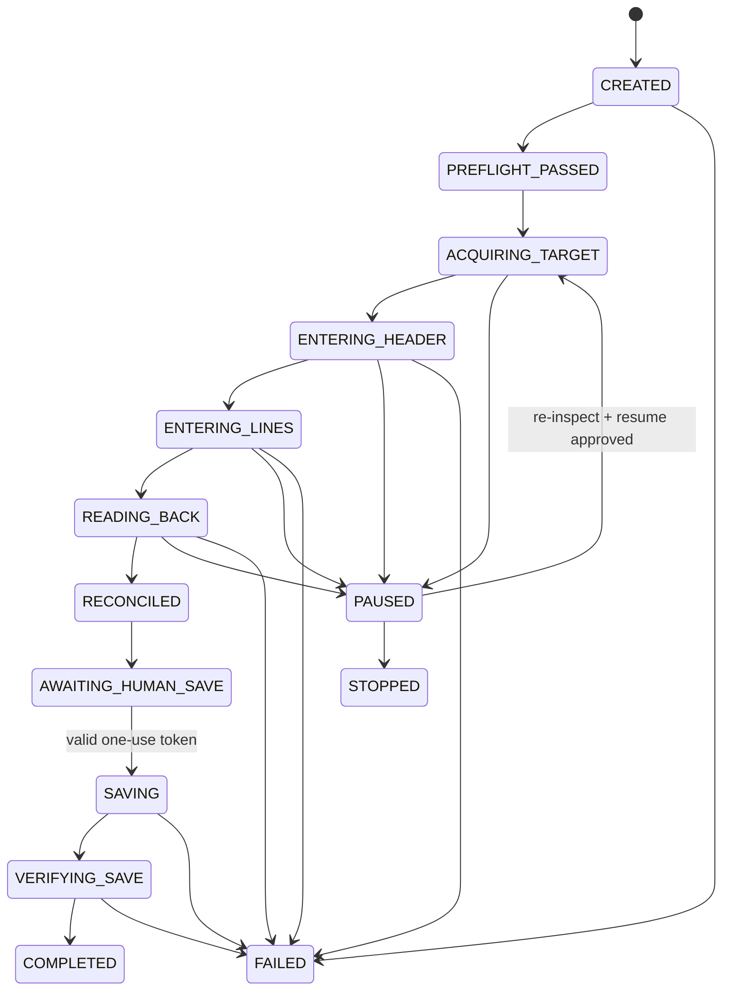

# OCR Inbound Desktop App — Architecture & Sonnet 5 Build Specification

สถานะ: Approved staging implementation architecture (goal-scoped amendment 2026-07-22)  
วันที่: 22 กรกฎาคม 2026  
ผู้อ่านหลัก: Product owner, technical lead และ Sonnet 5 ที่จะลงมือสร้างระบบ

เอกสารนี้เป็น companion ของ:

- `docs/PROJECT_BIBLE.md` — เหตุผล หลักการ และลำดับการพัฒนาที่มีอำนาจสูงสุด
- `docs/REVIEW_APP_DESIGN_BRIEF_TH.md` — product/UX requirements
- `README.md` — contract และวิธีใช้งาน OCR Layers A–E ปัจจุบัน

หากเอกสารขัดกัน ให้ใช้ลำดับข้างต้นก่อนเอกสารนี้ ห้ามแก้โค้ดให้สวนทางกับ
`PROJECT_BIBLE.md` แบบเงียบ ๆ

### Implementation amendment — 2026-07-22

Owner decisions in `SOL_LIGHT_ONE_GOAL_BUILD_PROMPT_TH.md` authorize the staging operational
companion and require comparative UI evidence. The completed spike in
`spikes/ui_comparison/EVIDENCE.md` selects a **local-web desktop UI** served on loopback by Python,
superseding PySide6-specific UI/build details below. Domain/application/port boundaries, SQLite
single-writer ownership, OCR/ADA worker isolation, and all safety invariants remain unchanged.

---

## 1. คำตัดสินทางสถาปัตยกรรม

ให้สร้างเป็น **Windows-local, offline-first modular monolith** โดยมี desktop UI
หนึ่งตัวและแยกงานเสี่ยง/งานหนักออกเป็น worker process ไม่สร้าง distributed system
และไม่ใช้ Electron, Tauri, microservices หรือ cloud เป็นแกนของ MVP

Technology baseline:

| ส่วน | เทคโนโลยีที่เลือก | เหตุผล |
|---|---|---|
| Desktop UI | Python 3.11 x64 local-web on `127.0.0.1` | runnable with the current toolchain, reuses `fusion_review_ui` patterns, and supports the required keyboard-first flow without adding an unavailable UI ecosystem |
| Application/domain | Python modules แบบ typed, ports-and-adapters | แยก business rule ออกจาก widget, OCR, SQL และ Win32 เพื่อทดสอบได้ |
| Operational database | stdlib `sqlite3`, WAL mode, numbered SQL migrations | local single-workstation, explicit transactions/constraints, online backup/restore, and zero added runtime dependency |
| Immutable artifacts | filesystem ภายใต้ environment root | PDF, page images, OCR raw output, screenshots และ logs ใหญ่เกินกว่าจะใส่ DB |
| ADA read adapter | atomic local `ada_cache.db` fixture/cache; future `pyodbc` SELECT-only gateway is disabled | Fake/cache product/supplier/history flow works without inventing live AdaAcc schema or permission proof |
| ADA UI adapter | JSONL worker hosts deterministic Fake/Replay; future Win32/pywin32 driver is disabled | host remains the only DB writer and unproven live UI behavior cannot execute |
| Packaging | deterministic compressed Python zipapp + PowerShell launcher | stdlib-only staging artifact has a SHA-256 manifest and launch health smoke; installer/signing remain production blockers |
| Tests | stdlib `unittest`, browser contract checks และ fake/record-replay ADA driver | reproducible in the current Python 3.11 environment without relying on accidental packages |

ข้อห้ามใน MVP:

- ห้ามเขียน `INSERT`, `UPDATE`, `DELETE`, stored procedure ที่ mutate หรือ raw SQL ใด ๆ
  ไปยัง `AdaAcc`
- ห้ามให้ OCR worker หรือ ADA worker เปลี่ยน operational DB โดยตรง
- ห้ามรวมคำสั่งกรอก ADA และคำสั่ง Save เป็น operation เดียวกัน
- ห้ามเพิ่ม embeddings, LLM, ML หรือ auto-approval จนกว่า stage gate ใน Project Bible จะผ่าน
- ห้าม redesign `ocr_feasibility.py` Layers A–E ให้เขียน adapter รับ output เดิมแทน
- ห้ามแสดง product prediction ก่อน transaction ที่บันทึก `layer_f_predictions` สำเร็จ
- ห้าม correction โดยไม่มี `error_category`
- ห้ามใช้ binary floating point คำนวณเงิน จำนวน หรือ reconciliation

### 1.1 เหตุผลที่ไม่ใช้ HTTP server ปัจจุบันเป็น production desktop backend

`fusion_review_server.py` และ `fusion_review_ui/` เป็น diagnostic prototype ที่มีประโยชน์
สำหรับตรวจ OCR regions/table geometry แต่ปัจจุบันอ่าน run เดียว เก็บ decision เป็น JSON/CSV
และไม่มี transaction/state machine/idempotency ที่ workflow จริงต้องใช้

ให้รักษาเครื่องมือเดิมไว้ ไม่ลบและไม่ rewrite ในช่วงแรก Desktop app จะอ่าน artifacts เดิมผ่าน
`OcrArtifactAdapter` และใช้ operational database ใหม่สำหรับ workflow จริง

---

## 2. Architecture drivers

สถาปัตยกรรมต้อง optimize ตามลำดับนี้:

1. ลด human minutes per invoice โดยไม่ลด accuracy
2. ไม่มี duplicate และไม่มี save เมื่อ row count หรือยอดไม่ตรง
3. ทุกคำตอบที่คนเห็นย้อนกลับไปยัง source evidence และ prediction version ได้
4. โปรแกรม recover จาก OCR/ADA crash, popup, focus loss และ app restart ได้
5. ใช้ของเดิมให้มากที่สุดและเพิ่มความซับซ้อนเมื่อมีผู้ใช้ของส่วนนั้นจริงเท่านั้น

MVP deployment assumption:

- Windows workstation หนึ่งเครื่องต่อ ADA instance
- review ได้ทีละ invoice ตาม scope ปัจจุบัน แต่ Inbox เก็บคิวได้หลายใบ
- OCR queue ทำทีละหนึ่ง job ใน MVP เพื่อควบคุม RAM/CPU
- ADA automation ทำได้เพียงหนึ่ง run ต่อ ADA instance
- network อาจขาดชั่วคราว แต่ก่อนส่ง ADA ต้องต่อ `AdaAcc` และตรวจ live preflight ได้
- UI เป็น Thai-first; identifier, log code และ source code ใช้ภาษาอังกฤษ

---

## 3. System context และ process boundaries



มีสาม process boundary:

1. **Desktop host process** — loopback HTTP UI, application services, domain rules, DB repositories,
   query model และ worker supervision เป็น process เดียวและเป็นผู้เขียน `app.db` เพียงรายเดียว
2. **OCR worker** — เรียก pipeline เดิมผ่าน subprocess, เขียน artifacts ใน run directory,
   ส่ง progress/result กลับ แต่ไม่รู้จัก UI/DB
3. **ADA automation worker** — ครอบ Win32 automation, popup/focus/human-input watcher,
   screenshot และ readback; disconnect จาก host แล้วต้อง pause/stop safely

IPC ระหว่าง host กับ worker ใช้ versioned JSON Lines ผ่าน stdin/stdout ของ `subprocess.Popen` ใน MVP
ทุก message ต้องมี `protocol_version`, `message_id`, `correlation_id`, `document_id` หรือ
`automation_run_id` และ timestamp ส่วน diagnostics ไป stderr เพื่อไม่ทำลาย protocol

ตัวอย่าง event:

```json
{
  "protocol_version": 1,
  "message_id": "01K...",
  "kind": "ADA_STEP_OBSERVED",
  "automation_run_id": "01K...",
  "document_id": "01K...",
  "command_id": "fill-row-0007",
  "step": "ENTER_LINE",
  "line_sequence": 7,
  "observed": {"product_code": "6301234", "quantity": "12"},
  "occurred_at": "2026-07-22T10:15:31.412+07:00"
}
```

Worker ต้อง heartbeat อย่างน้อยทุก 1 วินาทีระหว่าง run หากหายเกิน timeout ให้ host แสดง
`connection lost` และไม่ถือว่างานสำเร็จ Worker ต้องเข้า safe pause เมื่อ pipe ถูกตัด

---

## 4. Logical layers และ dependency rule

```text
presentation  -> application -> domain
                         |       ^
                         v       |
                   ports/interfaces
                         ^
                         |
                   infrastructure
```

### 4.1 Presentation

รับผิดชอบเฉพาะ widget, view state, focus, keyboard command, locale และการ render evidence
ห้าม widget เรียก SQL, filesystem, OCR subprocess หรือ Win32 โดยตรง

View models สำคัญ:

- `InboxViewModel`
- `ReviewQueueViewModel`
- `ReviewWorkspaceViewModel`
- `ExceptionResolverViewModel`
- `AdaPreflightViewModel`
- `AutomationMonitorViewModel`
- `CompletionReceiptViewModel`
- `ProductMappingAdminViewModel`
- `SystemHealthViewModel`

### 4.2 Application

แต่ละ user intent เป็น command/use case ที่มี transaction boundary ชัดเจน:

- `ImportDocument`
- `StartOcr` / `RetryOcr`
- `ImportOcrArtifacts`
- `GenerateAndPersistPredictions`
- `ConfirmField`, `CorrectField`, `ConfirmLine`, `CorrectLine`, `RejectPrediction`
- `BulkConfirmEligibleLines`
- `ResolveException`
- `RefreshAdaReferenceCache`
- `PrepareAdaPreflight`
- `StartAdaDraftEntry`
- `PauseAdaRun`, `ResumeAdaRun`, `StopAdaRun`
- `AcceptReconciliation`
- `AuthorizeAdaSave`
- `VerifyAndCompleteAdaRun`
- `CancelDocument`

Command handler ต้องตรวจ authorization, current state, document revision และ invariants ก่อนเขียน
ทุกการแก้ current projection กับ append review/audit event ต้องอยู่ transaction เดียวกัน

### 4.3 Domain

เป็น pure Python เท่าที่ทำได้ ไม่มี Qt, SQLAlchemy, pyodbc, path จริง หรือ Win32

Aggregate/บริการหลัก:

- `Document` และ `DocumentLine`
- `DocumentWorkflowPolicy`
- `ReviewDecisionPolicy`
- `ProductMatchingPolicy` (Layer F)
- `AliasPromotionPolicy`
- `InvoiceValidationService`
- `DuplicatePolicy`
- `AdaPreflightPolicy`
- `ReconciliationService`
- `SaveAuthorizationPolicy`
- value objects: `Money`, `Quantity`, `NormalizedInvoiceNumber`, `EvidenceRef`,
  `DocumentRevision`, `ProductCode`, `UnitCode`

### 4.4 Infrastructure adapters

- `SqliteDocumentRepository`
- `SqliteReviewEventRepository`
- `FilesystemArtifactStore`
- `ExistingOcrPipelineAdapter`
- `VersionedOcrArtifactImporter`
- `OdbcAdaReadGateway`
- `SqliteAdaCacheGateway`
- `Win32KeyboardAdaDriver`
- `FakeAdaDriver`
- `ReplayAdaDriver`
- `WindowsCredentialStore`
- `WindowsIdentityProvider`
- `StructuredAuditLogger`

Application layer รู้จัก adapter ผ่าน protocol/interface เท่านั้น ทำให้ test เปลี่ยนเป็น fake ได้

---

## 5. Proposed repository layout

รักษาไฟล์ OCR เดิมไว้ที่ตำแหน่งเดิมก่อน แล้วเพิ่ม package ใหม่แบบนี้:

```text
src/ocr_inbound/
  __main__.py
  bootstrap.py
  config.py
  presentation/
    main_window.py
    navigation.py
    commands.py
    models/
      inbox_model.py
      review_table_model.py
      product_candidates_model.py
      automation_events_model.py
    views/
      inbox_page.py
      review_workspace.py
      exception_resolver.py
      ada_preflight.py
      automation_monitor.py
      completion_receipt.py
    widgets/
      document_viewer.py
      evidence_panel.py
      review_item_delegate.py
      status_badge.py
  application/
    commands.py
    queries.py
    dto.py
    services/
      import_service.py
      ocr_job_service.py
      review_service.py
      matching_service.py
      validation_service.py
      ada_orchestrator.py
      completion_service.py
  domain/
    document.py
    workflow.py
    review.py
    matching.py
    alias.py
    validation.py
    reconciliation.py
    duplicate.py
    money.py
    errors.py
  infrastructure/
    db/
      engine.py
      models.py
      repositories.py
      migrations/
    artifacts/
      store.py
      ocr_importer.py
    ada_read/
      gateway.py
      cache.py
      queries.py
    ada_automation/
      protocol.py
      supervisor.py
      profiles.py
    identity/
      windows.py
    logging/
      structured.py
workers/
  ocr_worker.py
  ada_worker.py
  ada/
    driver.py
    window_locator.py
    header_controls.py
    grid_protocol.py
    popup_watcher.py
    input_watcher.py
    screenshot.py
resources/
  locales/th_TH.json
  ada_profiles/4.6006.0030.json
  supplier_profiles/
    woothi.v1.json
    charoon_bhesaj.v1.json
    berlin_pharma.v1.json
tests/
  unit/
  integration/
  ui/
  contract/
  fixtures/
    ocr_top3/
    ada_replay/
scripts/
  probe_ada_controls.py
  refresh_ada_cache.py
  backup_local_data.py
alembic.ini
pyproject.toml
```

ห้ามย้าย/rename `ocr_feasibility.py`, `ocr_environment.py`,
`fusion_review_server.py` หรือ artifact folders ใน vertical slice แรก

---

## 6. Operational data ownership

แยกข้อมูลเป็นสามส่วน:

```text
app.db       = workflow/current state/review/audit/automation state (source of truth ของ app)
ada_cache.db = สำเนา read-only ที่ refresh ได้จาก AdaAcc (ไม่ใช่ source of truth)
artifacts/   = immutable source, OCR evidence, screenshots, raw logs, receipts
```

### 6.1 กฎข้อมูลทั่วไป

- Primary key ใช้ UUIDv7 หรือ ULID แบบ string สร้างที่ application boundary
- timestamp เก็บ ISO-8601 UTC ใน DB และแสดง Asia/Bangkok ใน UI
- เงิน/จำนวนใช้ `Decimal`; storage ใช้ canonical decimal string หรือ scaled integer ที่ระบุ
  scale ชัดเจน ห้ามใช้ `float`
- `grand_total`, VAT และเงินที่ reconcile ใช้ integer minor unit (สตางค์) หลังผ่าน
  supplier-specific deterministic rounding rule
- artifact path ใน DB เป็น relative path ภายใต้ environment root เท่านั้น พร้อม SHA-256
- append-only events ห้าม update/delete; การถอน label ใช้ event ใหม่ที่อ้าง `supersedes_event_id`
- SQLite เปิด foreign keys, WAL, busy timeout และ transaction; migration ก่อน upgrade ต้อง backup
- production/staging ใช้คนละ DB, cache, artifact root, credential key และ named mutex

### 6.2 MVP operational tables

ตารางด้านล่างเป็น logical target schema แต่ต้องสร้าง migration แบบ just-in-time เมื่อ vertical
slice มีทั้ง writer และ reader แล้วเท่านั้น ตาม anti-overengineering rule

#### `documents`

Current projection สำหรับ query/queue และ state machine:

- `id`, `environment`, `source_filename`, `source_sha256`, `source_artifact_path`
- `page_count`, `ocr_run_id`, `ocr_version`, `ruleset_version`, `layout_version`
- `status`, `last_stable_status`, `failure_phase`, `failure_code`
- `supplier_code`, `supplier_confidence`
- `invoice_number_raw`, `invoice_number_normalized`, `invoice_date`
- `reference_number`, `payment_type`, `credit_days`, `due_date`, `currency`
- `subtotal_minor`, `discount_minor`, `vat_rate`, `vat_minor`, `grand_total_minor`
- `duplicate_key`, `revision`, `review_snapshot_hash`
- `created_by`, `created_at`, `updated_at`, `completed_at`

Constraints:

- `revision >= 1`
- normalized confidence อยู่ `[0,1]` หรือ null
- `source_sha256` unique ภายใน environment; import ซ้ำให้เปิดเอกสารเดิม
- `duplicate_key` ต้องมี index และ claim เพียงเอกสาร active หนึ่งใบ; override ต้องมี admin
  action + reason ใน audit trail

#### `document_fields`

Current field projection สำหรับ Header Review; importer เป็น writer แรกและ Review Workspace/
Ready guard เป็น reader:

- `id`, `document_id`, `field_name`, `field_type`, `required`
- `raw_source_text`, `predicted_value_json`, `final_value_json`
- `confidence`, `evidence_json`, `source_prediction_ref`
- `review_status`: `UNREVIEWED`, `CONFIRMED`, `CORRECTED`, `NEEDS_REVIEW`, `NOT_APPLICABLE`
- `validation_status`, `field_revision`, `created_at`, `updated_at`

Unique `(document_id, field_name)` Header summary fields ที่ใช้ queue/duplicate/preflight เช่น supplier,
invoice number/date และ totals ต้อง project ไป `documents` ใน transaction เดียวกันเพื่อ query เร็ว
โดย `document_fields` เป็นแหล่ง current review state และ `review_events` เป็น history/label source

#### `document_lines`

- `id`, `document_id`, `sequence`, `page_number`, `source_row_ref`
- `raw_ocr_text`, `supplier_sku`, `description_raw`, `description_final`
- `unit_raw`, `unit_final`, `quantity`, `free_quantity`
- `unit_price`, `discount_minor`, `line_total_minor`
- `lot_number`, `expiry_date`
- `ada_product_code`, `ada_product_name_snapshot`, `ada_unit_code`
- `match_status`, `match_method`, `match_confidence`, `match_provenance_json`
- `current_prediction_id`, `review_status`, `row_revision`
- `created_at`, `updated_at`

Unique `(document_id, sequence)` และห้าม `READY_FOR_ADA` หาก line ใดยังไม่มี valid
product code/unit หรือมี red validation issue

#### `layer_f_predictions`

เป็น immutable row และ **ต้อง commit ก่อน UI ได้รับ DTO ที่จะแสดง**:

- `id`, `document_id`, `document_line_id`
- `tier`, `method`, `source_text`, `normalized_text`, `input_hash`
- `proposed_product_code`, `proposed_unit_code`, `confidence`
- `candidate_set_json`, `reason_codes_json`, `provenance_json`
- `evidence_json`, `ocr_engine_versions_json`
- `ruleset_version`, `model_version` (null ใน deterministic MVP)
- `created_at`

ทุก tier รวม exact code, alias, exact normalized name, purchase history, fuzzy suggestion และ
unresolved ต้องมี prediction row การสร้าง row ไม่เท่ากับการยืนยัน

#### `review_events`

เป็น labeled decision แบบ append-only:

- `id`, `interaction_id`, `batch_target_count`
- `document_id`, `document_line_id`, `field_name`, `prediction_id`
- `action`: `CONFIRM`, `CORRECT`, `REJECT`, `MARK_NEEDS_REVIEW`, `RETRACT_LABEL`
- `original_value_json`, `proposed_value_json`, `final_value_json`
- `error_category` — mandatory เมื่อ `CORRECT`, `REJECT` หรือ retract/correct label เดิม
- `evidence_json`, `source_text`, `ocr_candidates_json`, `ada_product_code`
- `supplier_code`, `document_type`, `layout_version`
- `ocr_versions_json`, `ruleset_version`, `model_version`
- `reviewer_id`, `reviewer_display_name`
- `decision_duration_ms`, `occurred_at`, `supersedes_event_id`

Bulk confirm สร้างหนึ่ง event ต่อ target เพื่อใช้เป็น label แต่ใช้ `interaction_id` เดียวกัน
metrics ต้องนับ duration ของ interaction นั้นเพียงครั้งเดียว ไม่บวกเวลาซ้ำตามจำนวนแถว

#### `supplier_product_aliases`

- `id`, `supplier_code`, `normalized_supplier_text`, `ada_product_code`
- `status`: `CANDIDATE`, `ELIGIBLE`, `ACTIVE`, `QUARANTINED`, `DISABLED`
- `confirmation_count`, `correction_count`, `distinct_document_count`
- `first_seen_at`, `last_seen_at`, `conflict_group_key`
- `approved_by`, `approved_at`, `disabled_reason`, `version`

กฎ MVP:

- correction/confirmation หนึ่งครั้งสร้างหรือเพิ่ม candidate ได้ แต่ห้าม activate
- ถึงเกณฑ์อย่างน้อย 3 distinct documents และไม่มี product conflict จึงเป็น `ELIGIBLE`
- `ACTIVE` ต้องมี named admin approval จนกว่า Project Bible จะอนุญาต policy ขั้นถัดไป
- normalized text เดียวของ supplier ที่ชี้หลาย product code ต้อง `QUARANTINED` ทุกตัว

#### `automation_runs`

- `id`, `document_id`, `document_revision`, `review_snapshot_hash`
- `idempotency_key`, `state`, `current_step`, `current_line_sequence`
- `ada_process_id`, `ada_version`, `target_company`, `target_branch`
- `preflight_json`, `preflight_hash`, `reconciliation_json`, `reconciliation_hash`
- `started_by`, `save_authorized_by`, `started_at`, `finished_at`
- `ada_document_number`, `failure_code`, `failure_detail_redacted`
- `before_screenshot_ref`, `after_screenshot_ref`, `receipt_artifact_ref`

มี unique active run ต่อ ADA instance และ idempotency key ผูกกับ
`document_id + revision + company + branch`

#### `automation_events`

- `id`, `automation_run_id`, `sequence`, `message_id`, `command_id`
- `kind`, `severity`, `step`, `line_sequence`
- `expected_json`, `observed_json`, `popup_fingerprint`
- `screenshot_ref`, `occurred_at`

Unique `(automation_run_id, sequence)` และ `(automation_run_id, message_id)` เพื่อ replay event
จาก worker ได้โดยไม่บันทึกซ้ำ

#### `audit_events`

- `id`, `actor_id`, `action`, `entity_type`, `entity_id`
- `correlation_id`, `before_hash`, `after_hash`, `detail_json`, `occurred_at`

เก็บ security/safety/business actions เช่น duplicate override, status transition,
preflight, save authorization, setting change และ alias approval โดยไม่เก็บ secret

### 6.3 Historical learning tables

`erp_ground_truth`, `document_links`, `line_links` เป็น prerequisite ตาม Project Bible
และต้องสร้างเมื่อมี importer/alignment writer และ verification reader จริงเท่านั้น Frozen holdout,
dataset/model tables และ Learning/Data Quality UI ไม่ใช่ MVP migration

### 6.4 ADA cache database

สร้าง `ada_cache.db.next`, sync ด้วย named SELECT queries แล้ว validate count/schema/hash ก่อน
atomic replace เป็น `ada_cache.db`:

- `products(product_code, barcode, name, ingredient, strength, size, manufacturer, active, snapshot_at)`
- `product_units(product_code, unit_code, factor, active)`
- `suppliers(supplier_code, tax_id, name, active)`
- `purchase_history(supplier_code, product_code, last_price, purchase_count, last_purchase_date)`
- `cache_manifest(source_instance, schema_fingerprint, refreshed_at, row_counts)`

UI search ใช้ cache เพื่อให้เร็ว แต่ ADA preflight ต้อง revalidate product/supplier/unit ที่เลือก
กับ live `AdaAcc` แบบ SELECT-only อีกครั้ง ถ้า live query ไม่ได้ให้ block การส่ง ไม่เดา

### 6.5 Versioned supplier profiles

Top 3 suppliers ต้องมี versioned deterministic profile ที่รวม:

- supplier identity signals ที่อนุญาต เช่น tax ID/name/address/code pattern
- document type/layout ID และ header/column extraction mapping
- unit normalization, Thai numeral/date rule และ field requirements
- line-total/VAT/rounding rule
- match thresholds และ ADA supplier mapping
- profile version, schema version, author, approver และ activation date

MVP เริ่มจาก immutable validated JSON ภายใต้ `resources/supplier_profiles/` และ pin version ลง
document ทุกใบ หน้า Supplier Templates อ่าน/ตรวจ health/version ได้ การแก้จาก UI เป็น vertical slice
ถัดไปที่ต้องมี draft/validate/activate/audit reader-writer ครบก่อนจึงค่อยเพิ่ม
`supplier_profile_versions` table ห้ามให้แก้ production JSON โดยตรงจาก text box

Profile ใหม่/การ activate rule ที่เพิ่ม automation ต้องมี named approval และทดสอบ golden fixtures
ก่อนใช้ เอกสารเก่าต้องคง profile version เดิมเพื่อ reproducibility

---

## 7. Immutable artifact store

โครงสร้าง production/staging ต้องแยกทางกายภาพ:

```text
<environment-root>/
  app.db
  ada_cache.db
  documents/<document-id>/
    source/original.pdf
    manifest.json
    ocr/<ocr-run-id>/...existing pipeline contract...
    evidence/
    automation/<automation-run-id>/
      events.ndjson
      before-fill.png
      reconciliation.png
      before-save.png
      after-save.png
      receipt.json
  logs/YYYY-MM-DD.ndjson
  backups/
```

Import ต้อง copy source ไปที่ app-owned path ด้วย temporary filename, hash ขณะ stream,
fsync/close แล้ว atomic rename ห้ามเก็บแค่ path ที่ผู้ใช้เลือก เพราะไฟล์อาจถูกย้าย/แก้ภายหลัง
ต้นฉบับเป็น immutable; rotate/deskew/preprocess เป็น derivative artifact เท่านั้น

`manifest.json` เก็บ SHA-256, byte size, MIME ที่ตรวจจาก content, original name, importer version
และ derivative refs ห้ามเชื่อ extension อย่างเดียว

---

## 8. Document state machine

ใช้สถานะ public ตาม Design Brief เท่านั้น รายละเอียด recovery เก็บใน substate/failure fields



Transition guards:

- `PROCESSING -> NEEDS_REVIEW`: artifact contract/version/checksum ผ่านและ current projections ถูกสร้าง
- `NEEDS_REVIEW -> READY_FOR_ADA`: required fields/lines confirmed, no red issue, local duplicate
  check ผ่าน, product codes อยู่ใน cache และ totals reconcile ตาม rule
- `READY_FOR_ADA -> SENDING_TO_ADA`: document revision/hash ยังตรง, live duplicate/product/supplier,
  ADA process/version/company/branch/form และ global mutex ผ่านทั้งหมด
- `SENDING_TO_ADA -> ADA_REVIEW_REQUIRED`: readback supplier, invoice number, row count และ
  grand total ตรง 100%; ถ้าไม่ตรงต้องอยู่ `SENDING_TO_ADA` substate paused/failed และแสดง diff
- `ADA_REVIEW_REQUIRED -> COMPLETED`: one-use human save authorization, ADA save response,
  document number readback และ post-save evidence สำเร็จ

การแก้ reviewed value ใด ๆ ต้องเพิ่ม `documents.revision`, ทำให้ preflight/reconciliation/save token
เก่าหมดอายุ และกลับ `NEEDS_REVIEW` ตามความเหมาะสม

### 8.1 ADA automation run state machine

Document status บอกสิ่งที่ผู้ใช้เห็น ส่วน `automation_runs.state` ต้องละเอียดพอสำหรับ monitor,
recovery และ audit:



`PAUSED` ไม่จำว่า cursor/grid พร้อมทำต่อโดยปริยาย การ resume ต้อง inspect target ใหม่และผ่าน
profile-specific recovery guard `STOPPED` หมายถึงหยุด input อย่างปลอดภัย ไม่ได้หมายความว่า
ADA draft ถูกลบ ส่วน `FAILED` ต้องมี last verified checkpoint และ recovery instruction

---

## 9. End-to-end data flow

### 9.1 Import และ OCR

1. Validate file type/size/readability และ copy ต้นฉบับเข้า artifact store
2. คำนวณ SHA-256; ถ้าซ้ำให้เปิด document เดิม ไม่สร้างงานใหม่
3. สร้าง `documents` เป็น `NEW` และ audit event ใน transaction
4. Host สั่ง OCR worker พร้อม environment, immutable source path และ output path ที่ validate แล้ว
5. Worker เรียก pipeline เดิมและส่ง progress; UI ไม่ freeze
6. Worker จบแล้ว `VersionedOcrArtifactImporter` ตรวจ required files/schema/checksum
7. Import raw extraction/current projections; เก็บ OCR evidence refs และ versions
8. คำนวณ business duplicate key เมื่อ supplier/invoice/date/total พร้อม
9. เปลี่ยนเป็น `NEEDS_REVIEW`; artifact ที่ไม่ครบเป็น `FAILED` แบบ retryable

หาก app เปิดใหม่แล้วพบ `PROCESSING` แต่ไม่มี live worker ให้ mark failure phase ว่า
`ORPHANED_OCR_PROCESS`; ห้ามถือว่า OCR สำเร็จจากการมี directory อย่างเดียว

### 9.2 Product matching และ prediction-before-display

Layer F v1 ทำตามลำดับ deterministic:

1. exact internal code/barcode (`IC-XXXX`, `630XXXX`)
2. active supplier-specific alias
3. exact normalized product name
4. supplier purchase history exact/support signal
5. fuzzy candidate list เพื่อเสนอเท่านั้น
6. unresolved to human

Supplier identification, Thai/BE date parsing, Thai numeral conversion, unit normalization,
quantity parsing และ threshold เป็น deterministic versioned rules เสมอ

Application flow ต้องเป็น:

```text
extract input
  -> compute candidates/provenance
  -> BEGIN TRANSACTION
  -> INSERT layer_f_predictions
  -> update line.current_prediction_id
  -> COMMIT
  -> query ReviewWorkspace DTO
  -> render to user
```

ถ้า transaction fail ห้าม render candidate นั้น ให้แสดง technical retry state

### 9.3 Human review

- เมื่อ focus เข้า field/row ให้เริ่ม monotonic interaction timer
- Confirm/Correct เขียน current value + `review_events` + audit/current revision ใน transaction เดียว
- correction ต้องเลือก `error_category` ก่อน commit
- preserve original OCR value, proposed value, final value, candidates, evidence และ versions
- label ที่พบว่าผิดภายหลังไม่ update row เดิม ให้ append `RETRACT_LABEL`/corrective event
- bulk confirm ใช้ได้เฉพาะแถวที่ validation ผ่านและไม่มี ambiguity; สร้าง label ต่อแถว

### 9.4 Ready, ADA draft, reconciliation และ save

1. Run deterministic validation และ local duplicate check
2. Freeze `review_snapshot_hash` จาก canonical reviewed document revision
3. Live preflight ADA + AdaAcc; บันทึก input/output snapshot
4. ขอ named mutex ของ ADA instance
5. สร้าง `automation_run` แล้วสั่ง worker กรอก **draft only**
6. ทุก step ใช้ observe → act → verify; persist worker event แบบ idempotent
7. เมื่อกรอกครบ อ่าน supplier, invoice number, row count และ totals กลับ
8. Reconciliation service เทียบ canonical value; mismatch ใด ๆ block save
9. ถ้าตรงทั้งหมด เปลี่ยนเป็น `ADA_REVIEW_REQUIRED` และแสดง summary/diff=none
10. ผู้ใช้กด `ยืนยันบันทึกใน ADA` จึงสร้าง one-use save token
11. Worker ใช้ token เรียก save command แยกต่างหาก
12. อ่าน ADA document number/สถานะหลัง save, screenshot และเขียน completion receipt
13. เปลี่ยน document เป็น `COMPLETED`, release mutex และห้ามส่งซ้ำ

---

## 10. Validation และ reconciliation contract

`InvoiceValidationService` เป็น pure deterministic service และคืน list ของ issue:

```text
ValidationIssue {
  code, severity, target_type, target_id, field_name,
  expected, observed, message_key, rule_version, blocking
}
```

ขั้นต่ำต้องมี:

- required supplier/invoice/date
- invoice/business duplicate
- required product code และ valid ADA unit ทุก line
- quantity, free quantity, price, discount, line total format/range
- expiry not before invoice date เมื่อมี expiry
- line total ตาม supplier rounding rule
- header subtotal/discount/VAT/grand total ตาม rule
- unresolved red field/row
- stale product/supplier/cache status

Money rule:

- parse ด้วย `Decimal` จาก normalized string
- rounding mode และตำแหน่งทศนิยมเป็น versioned supplier profile
- default currency THB, grand total compare เป็นสตางค์แบบ exact
- ห้ามใช้ tolerance เงียบ ๆ หาก supplier ต้องมี tolerance ให้ตั้ง explicit rule + reason และยังต้อง
  แสดง discrepancy; MVP acceptance ใช้ exact row count และ exact grand total

Reconciliation หลังกรอก ADA ต้อง compare อย่างน้อย:

| ค่า | Expected | Observed | เกณฑ์ |
|---|---|---|---|
| Company/branch | preflight snapshot | ADA UI readback | exact |
| Supplier | reviewed supplier map | ADA UI readback | exact code |
| Invoice number | normalized reviewed value | ADA UI readback | exact normalized |
| Row count | count of reviewed payable lines | ADA grid readback | exact |
| Grand total | reviewed minor units | ADA total readback | exact |

หากอ่านค่าใดไม่ได้ให้ถือว่า `UNKNOWN` และ block save ไม่เท่ากับ pass

---

## 11. Duplicate prevention และ idempotency

ใช้หลาย checkpoint เพราะตอน import ยังไม่รู้ business identity:

1. **Import:** exact source SHA-256
2. **After extraction/review:** local business key = normalized supplier + invoice number + date + grand total
3. **Before ADA fill:** local active/completed check + live AdaAcc SELECT check
4. **Immediately before save:** ตรวจ document revision/hash และ duplicate/live state อีกครั้ง

ถ้า invoice number ไม่มีหรือไม่น่าเชื่อถือ ให้สร้าง duplicate exception จาก supplier/date/total/file
similarity และต้องให้คน resolve ห้ามเดา

ADA automation controls:

- Windows named mutex เช่น `Global\\OCRInbound.ADA.<instance-id>.<environment>`
- worker ระบุ target process ID + executable path + main class ไม่จับจาก title อย่างเดียว
- `idempotency_key` ผูกกับ document revision; command ทุกตัวมี stable `command_id`
- worker event replay ไม่สร้าง event ซ้ำ
- save token ผูก `run_id`, `document_revision`, `preflight_hash`, `reconciliation_hash`,
  actor และ expires ภายในช่วงสั้น ๆ; ใช้ได้ครั้งเดียว

หลัง crash ห้าม resume keystroke จากเลข row แบบ blind สำหรับ MVP ให้ inspect form และเลือกทางปลอดภัย:

- ถ้าพิสูจน์ได้ว่า ADA form ว่าง: restart จาก row 1
- ถ้าเป็น unsaved draft ของ run เดิมและ readback ตรงถึง checkpoint: เสนอให้คนเลือก clear/restart
  หรือ controlled recovery ตาม profile ที่ผ่าน test
- ถ้าพิสูจน์ไม่ได้: pause, screenshot, route exception; ห้ามกดต่อ
- ถ้าพบ saved document number: reconcile แล้ว complete existing run ห้ามสร้างใหม่

---

## 12. ADA integration architecture

### 12.1 Read-only SQL gateway

- production credential อยู่ Windows Credential Manager/DPAPI ไม่อยู่ `.env`, source, log หรือ screenshot metadata
- login ของ app ต้องได้รับสิทธิ์ SELECT เฉพาะ view/table ที่อนุมัติ ไม่มี write permission
- query อยู่ใน named query catalog พร้อม parameter binding ห้ามต่อ string จาก user input
- adapter API เปิดเฉพาะ read methods เช่น `find_product`, `find_supplier`,
  `get_purchase_history`, `find_existing_invoice`, `health_check`
- startup/CI test scan module นี้ไม่ให้มี mutation keywords; database permission เป็น safety ชั้นจริง
- log query name, duration, row count และ redacted error ไม่ log connection string/credentials

### 12.2 UI automation worker

แยก `AdaDriver` interface:

```python
class AdaDriver(Protocol):
    def inspect(self) -> AdaObservation: ...
    def preflight(self, expected: AdaTarget) -> PreflightResult: ...
    def start_blank_receipt(self, header: AdaHeader) -> StepResult: ...
    def enter_line(self, line: AdaLine, command_id: str) -> StepResult: ...
    def readback_draft(self) -> AdaDraftSnapshot: ...
    def save(self, authorization: SaveAuthorization) -> SaveResult: ...
    def stop_safely(self) -> StopResult: ...
```

`start_blank_receipt` และ `enter_line` ไม่มีสิทธิ์ save `save()` เรียกได้เฉพาะ command type
`AUTHORIZE_SAVE` ที่ผ่าน signature/hash/expiry validation

Window identification:

- allowlisted process image และ process ID
- main class `ThunderRT6MDIForm`
- ADA version profile `4.6006.0030`
- header controls ใช้ class/control ID/parent chain ที่ probe และบันทึกไว้
- custom grid profile ระบุ deterministic column order, lookup popup behavior, commit key และ readback
- pixel matching เป็น fallback ที่ปิดโดย default และต้องมี profile/version/evidence ของตัวเอง

ทุก action ใช้ pattern:

```text
observe current window/control/grid state
  -> validate expected state
  -> perform one bounded action
  -> wait with explicit timeout
  -> inspect popup/focus/state
  -> verify observed value
  -> emit event/checkpoint
```

Safety watcher:

- enumerate modal windows ของ target process ตลอด run
- known popup ใช้ versioned fingerprint + explicit handler; unknown popup pause ทันที
- monitor foreground window; ถ้าเปลี่ยนจาก expected ให้ pause
- low-level keyboard/mouse hook แยก injected input จาก physical input; physical input ระหว่าง run pause
- `Pause` หยุดก่อน action ถัดไปและคง evidence
- `Stop safely` หยุด input, inspect current state, ไม่กด save/cancel แบบเดา และ release lock เมื่อ safe
- timeout ทุก action พร้อม screenshot และ window/control dump แบบ redacted

เพราะ ADA เป็น VB6 32-bit แต่ OCR stack ต้องเป็น x64 ให้พิสูจน์ Win32 access จาก x64 ใน Phase 0
หาก custom control ต้องการ same-bitness จึงค่อยสร้าง minimal x86 ADA worker โดยไม่เปลี่ยน
`AdaDriver`/IPC contract ห้ามย้าย OCR ทั้งระบบไป x86 ล่วงหน้า

---

## 13. UI component architecture และ keyboard contract

ใช้ local route stack และ virtualized line-item grid ที่สร้าง DOM เฉพาะแถวใน viewport ห้ามสร้าง
control/widget หนึ่งชุดต่อ cell ทั้ง 100+ แถว UI ติดต่อ application ผ่าน loopback JSON API เท่านั้น
และห้ามแตะ SQL/filesystem/OCR/Win32 โดยตรง

Review Workspace ประกอบด้วย:

- `DocumentViewer`: raster page, zoom/rotate/page, `QGraphicsScene` evidence overlay
- `HeaderForm`: schema-driven fields, status icon/text/color และ validation message
- `LineItemsTable`: virtualized rows, inline editor, row/field status
- `EvidencePanel`: source crop, raw OCR candidates, match provenance, candidate search
- `IssueNavigator`: next/previous blocking issue
- `TotalsBar`: line subtotal, discount, VAT, expected grand total และ diff

View model ส่ง `EvidenceRef(page, normalized_bbox, artifact_hash)` ไป viewer ห้ามให้ widget
สร้าง bbox จาก OCR raw เอง

Keyboard baseline:

| Key | พฤติกรรม |
|---|---|
| `Tab` / `Shift+Tab` | เดินเฉพาะ editable/reviewable field |
| Arrow keys | ย้าย cell/row เมื่อไม่ได้อยู่ใน text edit |
| `Enter` | เข้า edit; Enter อีกครั้ง commit แล้วไป issue/field ถัดไป |
| `Esc` | ยกเลิก edit ปัจจุบัน ไม่เปลี่ยน persisted value |
| `Ctrl+Enter` | confirm current field/row ถ้าผ่าน guard |
| `Alt+Down` | เปิด product candidate/search panel |
| `F8` / `Shift+F8` | next/previous unresolved issue |
| `Ctrl+Shift+Enter` | bulk confirm เฉพาะ eligible visible rows พร้อม summary ก่อน commit |
| `Ctrl+I` | import document |

Final ADA save ไม่มี single-key shortcut และปุ่มไม่เป็น default focused button ผู้ใช้ต้องเห็น
reconciliation summary แล้วกด `ยืนยันบันทึกใน ADA` เพื่อออก one-use token

Correction flow:

- เปลี่ยนค่าแล้ว mark dirty เฉพาะ cell
- เมื่อ commit หาก final != proposed ต้องเลือก `error_category` ใน adjacent panel/compact dialog
- Enter หลังเลือก category จึง commit transaction
- ถ้า user เลื่อนไปที่อื่นก่อนเลือก ให้ field ยัง pending และ block Ready for ADA
- evidence highlight เปลี่ยนตาม focus โดยไม่แย่ง keyboard focus จาก table

UI ต้องแสดงสีพร้อม icon และข้อความเสมอ รองรับ 100%, 125%, 150% Windows scaling และ Thai font
ใช้ progressive disclosure: พนักงานเห็นเหตุผลแบบภาษางานก่อน confidence/OCR engine details

---

## 14. Exception model

อย่าใช้ Python exception string เป็นข้อความผู้ใช้ สร้าง stable domain codes เช่น:

- `SUPPLIER_UNRESOLVED`
- `DUPLICATE_EXACT`, `DUPLICATE_POSSIBLE`
- `PRODUCT_NOT_FOUND`, `PRODUCT_AMBIGUOUS`
- `UNIT_INVALID`, `QUANTITY_FORMAT_INVALID`, `PRICE_ANOMALY`
- `LINE_TOTAL_MISMATCH`, `INVOICE_TOTAL_MISMATCH`
- `ADA_NOT_RUNNING`, `ADA_WRONG_COMPANY`, `ADA_WRONG_BRANCH`
- `ADA_UNKNOWN_POPUP`, `ADA_FOCUS_LOST`, `ADA_ACTION_TIMEOUT`
- `ADA_READBACK_UNKNOWN`, `ADA_ROW_COUNT_MISMATCH`, `ADA_TOTAL_MISMATCH`
- `STALE_DOCUMENT_REVISION`, `STALE_ADA_CACHE`

Validation exception เป็น derived state คำนวณใหม่หลัง edit; automation exception เก็บใน
`automation_events` เพราะเป็น historical evidence Exception Resolver query รวมทั้งสองแบบและ
จัดกลุ่มตาม root cause/next action ไม่แสดง traceback แก่พนักงาน

ทุก failure ต้องมี:

- สิ่งที่ระบบคาด
- สิ่งที่สังเกตได้ หรือ `UNKNOWN`
- action ล่าสุดที่ยืนยันว่าเสร็จ
- evidence/screenshot/control dump
- safe next action: retry, edit, clear ADA draft, ask admin หรือ cancel

---

## 15. Learning loop ที่ MVP ต้องเก็บ แต่ยังไม่ train

MVP มีหน้าที่ผลิต labeled events คุณภาพสูง ไม่ใช่ deploy model:

```text
immutable prediction/evidence
  -> confirm/correct/reject event
  -> reversible active label projection
  -> alias candidate aggregation
  -> conflict quarantine
  -> later dataset versioning/holdout/model work after stage gate
```

กฎ:

- เก็บทั้ง confirm และ correct
- correction ทุกตัวมี error category
- label ผูก supplier/layout/document/field/product/versions
- review duration ใช้ monotonic clock และหยุดนับช่วง app inactive/idle ตาม explicit rule
- one correction ไม่ activate alias และไม่เป็น training truth แบบถอนกลับไม่ได้
- holdout assignment เมื่อเริ่ม historical dataset project ต้อง deterministic/stratified และ immutable
- Learning/Data Quality, dataset versions, shadow predictions และ model approval เป็น post-MVP
  vertical slices ห้ามสร้าง table เปล่ารอไว้

---

## 16. Security, privacy และ environment isolation

- Windows identity เป็น default actor (`DOMAIN\\user`/SID); role mapping แยก Reviewer/Admin
- การ approve alias, duplicate override, production setting และอนุญาต automation ต้องมี named actor
- secret เก็บ Windows Credential Manager/DPAPI; `.env` ใช้เฉพาะ dev/staging และห้าม log
- app bind network เป็นศูนย์โดย default; หาก diagnostic server ยังใช้ให้ bind `127.0.0.1` เท่านั้น
- artifact/log ACL ให้เฉพาะ application users; screenshots ถือเป็น sensitive business document
- structured log มี allowlist fields และ redaction filter สำหรับ password/connection string/token
- validate source/output path ด้วย resolved path ภายใต้ environment root; ป้องกัน path traversal
- staging/prod แยก data roots, mutex names, credentials, visual badge และ target company/branch allowlist
- production app ห้ามรับ arbitrary `--run-dir` ที่ชี้ staging; reuse/extend
  `ocr_environment.validate_environment_path()`
- update/installer ต้อง signed เมื่อเข้าสู่ production rollout; migration มี backup + rollback installer

---

## 17. Reliability และ recovery

- UI thread ห้ามทำ OCR, ODBC, file hash ใหญ่ หรือ Win32 automation
- host เป็น single-instance ต่อ environment data root
- worker supervised ด้วย heartbeat, bounded timeout และ explicit cancellation token
- artifact เขียน temp + atomic rename; DB transaction commit หลัง artifact checksum พร้อม
- app startup ทำ recovery scan สำหรับ stale `PROCESSING`, `SENDING_TO_ADA`, missing artifacts
- `SENDING_TO_ADA` ที่ orphaned ต้อง inspect ADA ก่อนเปลี่ยน state ห้าม reset เป็น Ready อัตโนมัติ
- SQLite backup ก่อน migration/upgrade และมี health check `PRAGMA integrity_check`
- disk space preflight ก่อน OCR และ screenshot-heavy automation
- completion receipt เขียนทั้ง JSON ที่ machine-readable และ printable HTML/PDF summary
- log rotation มี retention policy; การลบต้องไม่ทำลาย audit retention ที่กำหนด

System Health แสดงอย่างน้อย:

- app/build/schema/ruleset/OCR/ADA profile versions
- production/staging environment
- DB integrity/last backup/disk space
- OCR dependencies/model availability
- AdaAcc read-only connectivity/cache age
- ADA process/version/company/branch detection
- worker/mutex state

---

## 18. Observability และ metrics

Structured event ทุกตัวมี `correlation_id`, `document_id`, optional `line_id`, `run_id`, actor,
version และ timestamp โดยไม่เก็บ secret

ต้อง query metrics ต่อไปนี้จาก operational events ได้จริง:

- human minutes per invoice: first review focus ถึง Ready หัก idle ตาม documented rule
- decision duration จาก unique `interaction_id`
- first-pass confirmation rate
- field/line correction count แยก `error_category`
- match rate/precision แยก tier/method/supplier/layout
- automation success rate และ failure code
- reconciliation failure rate
- duplicate caught before ADA และ duplicate escaped (เป้าหมาย 0)
- alias candidate/conflict/eligible/approved counts

ห้ามเพิ่ม metric ที่ไม่มี event writer และ query/test reader ใน slice เดียวกัน

---

## 19. Test architecture และ proof gates

### 19.1 Unit tests

- every allowed/forbidden document state transition
- Money/Decimal/Thai numeral/BE-CE date/normalization/rounding
- duplicate key normalization
- validation and exact reconciliation
- Layer F cascade, no out-of-master candidate, alias quarantine/promotion
- save authorization binding/expiry/one-use
- document revision invalidates preflight/reconciliation/token

### 19.2 Repository/integration tests

- migrations from empty and previous schema, constraints/foreign keys/WAL
- atomic import + duplicate hash race
- review current projection and append event commit/rollback together
- prediction is persisted before query DTO becomes visible
- worker event replay idempotency
- cache refresh atomic replace and live revalidation failure blocks preflight
- artifact contract importer against golden outputs of Top 3 suppliers

### 19.3 UI tests

- keyboard navigation/edit/confirm/correct/error-category/bulk confirm
- focus does not jump to evidence viewer
- loading/empty/warning/conflict/failure/recovery states
- Thai rendering and 100/125/150% scaling
- blocking issue and save button disabled states use text/icon, not color only

### 19.4 ADA contract tests

มี driver สามแบบ:

1. `FakeAdaDriver` — deterministic in-memory สำหรับ application tests
2. `ReplayAdaDriver` — replay sanitized observation/popup/control fixtures
3. `Win32KeyboardAdaDriver` — live staging ADA เท่านั้นจนผ่าน proof gates

Fault-injection scenarios:

- unknown popup after header/any line/before save
- focus loss และ physical keyboard/mouse input
- product lookup not found, unit popup, price warning, duplicate line
- timeout after action sent but before acknowledgement
- host crash after row N, worker disconnect, app restart
- row count mismatch, total mismatch, unreadable total
- duplicate appears between preflight and save
- save succeedsแต่ post-save readback/log write fails

Live acceptance gate:

- ใช้ staging/test company/branch และเอกสารทดสอบ 30 ใบของ Top 3 suppliers
- automation success อย่างน้อย 95%
- row count + grand total reconciliation 100% ก่อน save
- zero duplicate และ zero write to AdaAcc outside ADA UI
- failure ทุกแบบหยุดได้โดยไม่กดข้าม/เดาและมี evidence
- production enablement ต้องมี named approval และ rollback/runbook

---

## 20. Build and deployment

- lock dependency ใน `pyproject.toml`/requirements lock; Python 3.11 x64
- staging package เป็น deterministic zipapp + Windows launcher; production installer/signing เป็น blocker ของ production activation และห้าม download OCR model/dependency ระหว่าง run
- installer ตรวจ Tesseract/Poppler/model assets/ODBC/ADA profile และแสดง actionable result
- application data อยู่ environment root ที่กำหนดใต้ `%PROGRAMDATA%` หรือ path ที่องค์กรอนุมัติ
  พร้อม ACL; source repo paths ใช้เฉพาะ development
- staging และ production ใช้ binary เดียวได้แต่ profile ถูก sign/config และแยก physical data/credentials
- migration workflow: stop workers → backup DB → migrate → integrity check → launch
- update fail ให้ rollback application version และ DB backup ตาม runbook ห้าม `git pull` บน workstation

---

## 21. Implementation phases สำหรับ Sonnet 5

สร้างเป็น vertical slices ที่ใช้งานและทดสอบได้ ห้าม scaffold ทุก table/screen แล้วปล่อย stub

### Phase 0 — Governance และ technical proof

1. อ่าน Project Bible, Design Brief, README และ architecture นี้ทั้งหมด
2. ยืนยัน current stage/priority กับ owner เนื่องจาก Project Bible วันที่ 10 มิ.ย. ระบุ first five
   schema objects only แต่ desktop brief วันที่ 21 ก.ค. ต้องใช้งาน operational tables เพิ่ม
3. หาก priority เปลี่ยน ให้เสนอ amendment ต่อ Project Bible ก่อนสร้าง migration ที่ขัดกัน
4. probe ADA staging: window/control IDs, grid keyboard order, popup, row-count/total readback,
   save/cancel semantics และ x64-to-VB6 compatibility
5. ยืนยัน read-only AdaAcc query/view contract และสร้าง least-privilege account
6. บันทึกผลเป็น ADR/probe fixtures; unknown capability ต้องไม่ถูกเขียนเป็น fake success

### Phase 1 — Foundation + Inbox

- package/bootstrap/config/environment isolation
- SQLite migration เฉพาะ tables ที่ Inbox ใช้จริง
- artifact import/hash/manifest/duplicate file open-existing
- Inbox/Queue loading/empty/error/recovery UI
- structured audit/log/Windows actor
- tests และ staging build

### Phase 2 — OCR adapter + Review Workspace

- supervised OCR worker ใช้ `ocr_feasibility.py` เดิม
- versioned artifact importer/golden contracts
- document viewer/evidence bbox/header/line current projections
- review state/revision/confirm/correct/error category/timing
- keyboard workflow และ validation issue navigation

### Phase 3 — ADA read cache + Layer F v1

- SELECT-only gateway/cache refresh/search
- exact code → alias → exact name/history → fuzzy suggestion → unresolved
- persist-before-display invariant
- product candidate provenance และ master-only constraint
- alias candidate/eligible/quarantine/admin approval

### Phase 4 — Ready gate + Exceptions

- all deterministic validators/reconciliation preview
- local/business duplicate handling
- exception grouping/recovery
- snapshot/revision invalidation
- Ready for ADA transition and acceptance tests

### Phase 5 — ADA preflight + draft automation

- fake/replay driver ก่อน live driver
- worker protocol/supervisor/mutex/heartbeat/pause/stop/popup/focus/input watcher
- live preflight, profile `4.6006.0030`, header/grid draft entry
- row-by-row monitor/checkpoints/screenshots
- **ยังไม่มี save** จน readback proof ผ่าน

### Phase 6 — Reconciliation + human save + completion

- exact readback/diff
- one-use save authorization แยก command
- post-save document number verification
- completion receipt/audit/recovery from partial success
- 30-document staging acceptance run

### Phase 7 — Production hardening

- installer, backup/migration/rollback, health page, retention, operations runbook
- UAT Thai keyboard workflow และ measure baseline human minutes/invoice
- named production approval

Post-MVP learning/data-quality/model workเริ่มได้เฉพาะเมื่อ Project Bible stage gates ผ่าน

---

## 22. Definition of Done ของ MVP

ถือว่าเสร็จเมื่อทั้งหมดนี้พิสูจน์ด้วย test/evidence ไม่ใช่แค่มีหน้าจอ:

- Top 3 suppliers import → OCR → review → correction → product match → Ready ได้
- prediction ทุกตัวที่แสดง trace ไป immutable record/evidence/version ได้
- correction ทุกตัวมี category, actor, duration, before/proposed/final และถอน label ได้
- cache/search/live preflight ใช้ AdaAcc แบบ read-only และ credential ไม่รั่วใน log
- automation กรอกผ่าน UI, row-by-row monitor, pause/stop เมื่อ popup/focus/human input
- save แยกจาก fill และเกิดหลัง human confirmation เท่านั้น
- row count/grand total exact ก่อน save และ unknown/readback failure block save
- duplicate prevention ผ่านทุก checkpoint; restart/recovery ไม่สร้างเอกสารซ้ำ
- completion receipt มี ADA number, actor, totals, timestamps, reconciliation, screenshots/log refs
- staging/production isolation และ test suite ผ่าน
- 30-document live staging run ได้ automation success ≥95%, reconciliation 100%, duplicate 0
- metrics หลัก query ได้จากข้อมูลจริง

---

## 23. Non-goals ของ MVP

- multi-machine server, cloud sync หรือ remote collaboration
- mobile/web companion
- direct database write ไป ADA
- unattended save/approval
- supplier นอก Top 3 ยกเว้นเก็บเป็น unsupported exception
- embeddings/LLM/ML training/deployment/auto-approval
- generic dashboard/BI platform
- arbitrary resume จาก ATL grid cell ที่ยังพิสูจน์ state ไม่ได้

---

## 24. ADRs ที่ Sonnet 5 ต้องสร้างพร้อม code

- `ADR-001-local-modular-monolith.md`
- `ADR-002-local-web-desktop.md`
- `ADR-003-worker-process-isolation.md`
- `ADR-004-sqlite-and-immutable-artifacts.md`
- `ADR-005-ada-read-only-sql-ui-write.md`
- `ADR-006-prediction-before-display.md`
- `ADR-007-human-gated-save.md`
- `ADR-008-production-staging-isolation.md`
- `ADR-009-reviewer-identity-boundary.md`

ADR ต้องระบุ decision, context, alternatives, consequences และ proof/revisit trigger ไม่คัดลอก
architecture ทั้งหน้า

---

## 25. Ready-to-use master prompt สำหรับ Sonnet 5

คัดลอกข้อความด้านล่างพร้อมเปิด repo นี้ให้ Sonnet 5:

```text
คุณคือ principal Windows desktop engineer และ safety-critical workflow implementer
ให้สร้าง OCR Inbound Desktop App ใน repository นี้ตาม source-of-truth order:

1. docs/PROJECT_BIBLE.md
2. docs/REVIEW_APP_DESIGN_BRIEF_TH.md
3. docs/DESKTOP_APP_ARCHITECTURE_TH.md
4. README.md และ existing code/artifact contracts

อ่านเอกสารทั้งหมดก่อนแก้ไฟล์ แล้วตรวจ git status เพื่อรักษางานเดิมของผู้ใช้
ห้ามลบหรือ rewrite OCR Layers A–E, fusion_review_server.py หรือ fusion_review_ui
ให้ต่อผ่าน versioned adapter และสร้าง vertical slices ตาม Phase 0–7 ใน architecture

Architecture บังคับ:
- Windows-local modular monolith, Python 3.11 x64, local-web desktop UI on loopback
- host process เป็น DB writer; OCR และ ADA automation เป็น supervised worker processes
- SQLite WAL + migrations สำหรับ operational state, filesystem สำหรับ immutable artifacts
- AdaAcc ใช้ SELECT-only least-privilege gateway; ห้าม SQL mutation ทุกกรณี
- กรอก ADA ผ่าน Win32/keyboard UI driver; fill draft กับ save เป็นคนละ command
- prediction ต้อง persisted ก่อนแสดง; correction ต้องมี error_category/audit/duration/evidence/version
- Decimal/scaled integer เท่านั้นสำหรับเงินและยอด; reconcile row count/grand total แบบ exact
- human one-use authorization ก่อน ADA save; no auto-save/auto-approval
- no embeddings, LLM, ML หรือ product นอก ADA master ใน MVP
- staging/production ต้องแยก DB, artifacts, credentials, mutex และ target profile

ก่อน implement migration ที่เกิน current-priority schema ใน Project Bible ให้ทำ Phase 0 governance
check และเสนอ patch amendment หากเอกสาร authoritative ยังไม่สะท้อน desktop MVP ห้ามข้าม conflict
แบบเงียบ ๆ

วิธีทำงาน:
1. สำรวจ code/output fixtures/dirty files และสรุป gap เทียบ architecture
2. สร้าง implementation plan เป็น vertical slice พร้อม Definition of Done และ test ต่อ slice
3. ทำ Phase 0 proof ด้วย staging/fake fixtures; capability ของ ADA ที่ยังไม่พิสูจน์ต้องเป็น explicit
   blocker/feature flag ห้ามทำ stub ที่รายงาน success
4. Implement ทีละ sliceให้ app รันได้จริง ทดสอบ unit/integration/UI/contract ทุกครั้ง
5. browser view ห้ามแตะ SQL/filesystem/subprocess/Win32 โดยตรง และ domain ห้าม import HTTP/UI/infrastructure
6. ทุก state transition, duplicate check, save authorization และ worker event ต้อง idempotent/auditable
7. สร้าง FakeAdaDriver และ ReplayAdaDriver ก่อนเปิด live Win32 driver
8. เมื่อ live proof ต้องใช้ ADA production, credential, schema choice หรือ business choice ที่เดาไม่ได้
   ให้หยุดเฉพาะส่วนนั้น รายงานหลักฐาน และทำส่วนที่ไม่ blocked ต่อ
9. อย่าประกาศ MVP complete จน Definition of Done section 22 ผ่านด้วย test/evidence

ผลส่งมอบทุก phase:
- working code และ migrations เฉพาะที่มี writer+reader
- automated tests และคำสั่ง run ที่ทำซ้ำได้
- ADR ที่เกี่ยวข้อง
- updated README/runbook
- explicit list ของ implemented, deferred by Project Bible, unproven ADA behavior และ known risks
- ห้าม commit secret, generated OCR data ขนาดใหญ่ หรือ production screenshot เข้า git

เริ่มจาก Phase 0 และ Phase 1 เท่านั้นในรอบแรก เว้นแต่ owner สั่งให้เดินหน้าต่อหลังเห็นผลทดสอบ
```

---

## 26. Open proof items ที่ต้องถือเป็น blocker เฉพาะ capability

รายการนี้สืบทอดจาก Design Brief และต้องตอบด้วย probe/staging evidence:

- ATL grid keyboard column order, row commit และการย้อนอ่านค่ารายแถว
- product lookup/unit selection popup fingerprints และ deterministic handling
- วิธีอ่าน row count และ grand total ที่เชื่อถือได้
- ความต่างระหว่าง save/approve/cancel และการตรวจ document number หลัง save
- recovery/clear unsaved draft ที่ไม่ทำให้เกิด duplicate
- AdaAcc view/schema สำหรับ existing-invoice duplicate check
- `ADACallAPI.dll` contract; ห้ามใช้จนพิสูจน์และยังห้าม bypass UI/business rules ใน MVP
- x64 worker ควบคุม VB6/custom ATL ได้ครบหรือจำเป็นต้องมี minimal x86 worker

สิ่งที่พิสูจน์ไม่ได้ไม่ต้องหยุดทั้งโครงการ ให้ใช้ fake/replay driver และปิด live capability ด้วย
feature flag จนมีหลักฐาน
